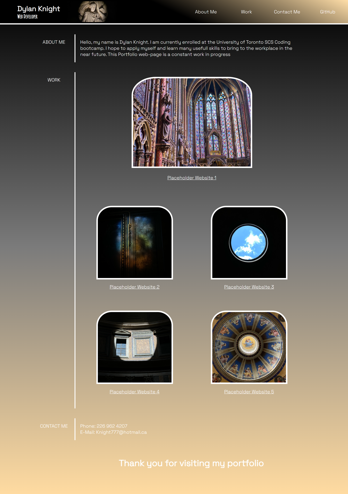

**DESCRIPTION:**
In this challenge we had to build a portfolio website from scratch to showcase our talent to potential employers. This proccess included building up the HTML and CSS pages in a clean easy to follow structure, speaking on ourselves as developers, including multiple links to our content and contact information and following the requirements set out by the user story and acceptance criteria.

**IMAGES**

**STANDARD FORMAT IMAGE**

**SMALL FORMAT IMAGE**

 [**GITHUB PAGES LINK**](https://dlonmusk.github.io/refactor-challenge/Develop/index.html)